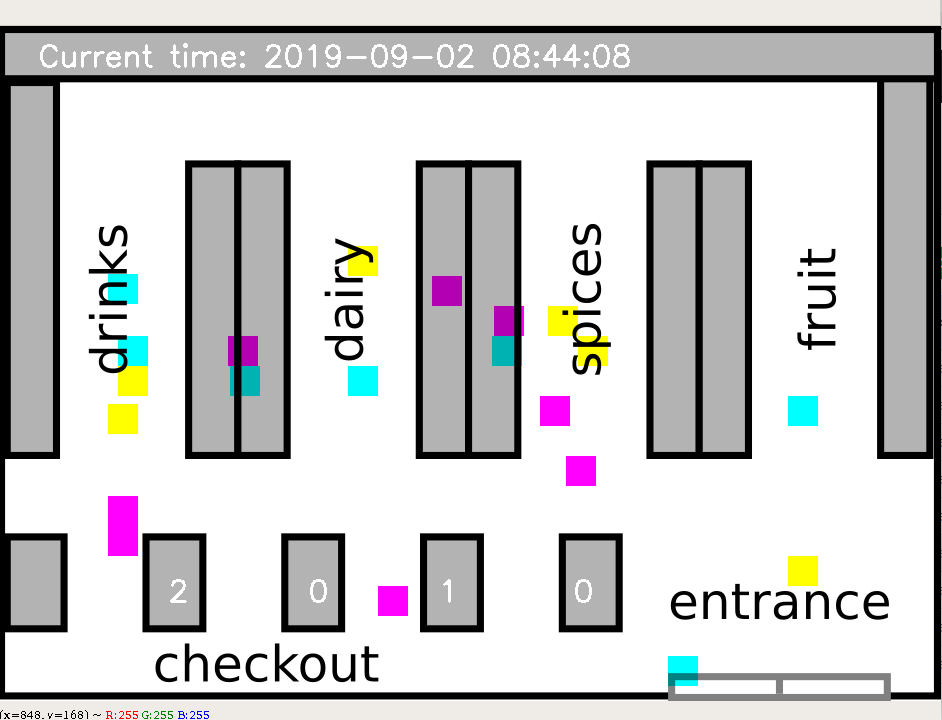

# supermarket_simulation
Simulation and visualization of customer behaviour in a supermarket, based on data analysis and calculation of transition probabilties (Markov chain).

You can start the simulation by executing the python file 'simulation.py'. You leave the simulation by pressing 'Q'.

The file 'calculate_transition_probabilities.py' calculates the transition probabilties based on 'supermarket_data'.

